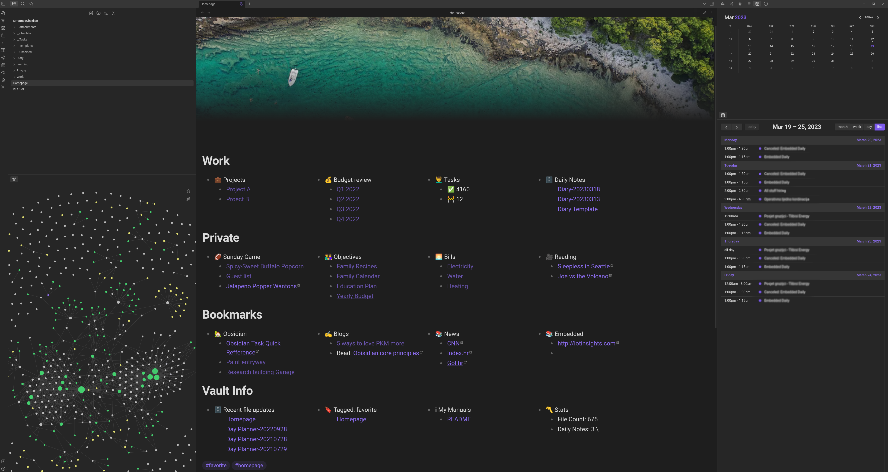

Obsidian reference vault with all needed plugins and customizations.

## Summary
Main view


### File Tree
- "__attachments__" -> Every folder has its own folder for attachments.
- "Homepage.md" -> Main page. This opens at boot.
- "__Tasks" -> All tasks goes here (try to use shortcut Alt + T).
- "__Templates" -> All templates are here.
- "__Unsorted" -> If you create new file and it is not set in the folder, it will be here.
- "Private" -> Private files
- "Private" -> Work related files (projects, people, meetings,...)
- "Learning" -> Learning materials and goals

```tree.txt
├── Homepage.md
├── .obsidian
├── __attachments__
├── __Tasks
│   ├── Ideas.md
│   └── Tasks.md
├── __Templates
│   ├── Company Role Template.md
│   ├── Company Template.md
│   ├── Diary Template.md
│   ├── Location Template.md
│   ├── Meetings
│   │   ├── 1on1 Meeting Template.md
│   │   ├── Problem Solving Meeting Template.md
│   │   └── Standard Meeting Template.md
│   ├── Person Template.md
│   └── Project Template.md
├── __Unsorted
│   └── __attachments__
├── Learning
├── Private
└── Work
    ├── Companies
    │   └── Boring Company.md
    ├── Company Roles
    │   ├── Role_QA.md
    │   └── Role_Software_Developer.md
    ├── Idea Dump.md
    ├── Locations
    │   └── Work Office.md
    ├── People
    │   ├── Person A.md
    │   └── Person B.md
    └── Projects
        └── Secret_Project
            ├── Meeting
            │   └── MoM 20230301.md
            └── Secret_Project.md
```


File structure. 


## How to use this?
s
## Features

## List of plugins 


## Shortcuts


