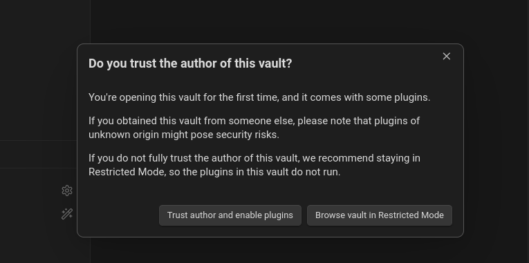
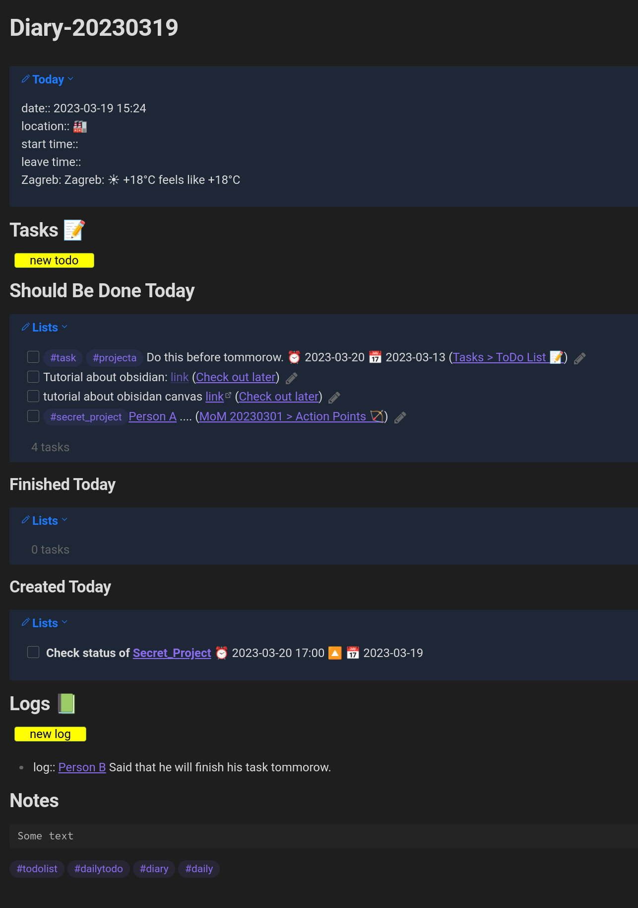
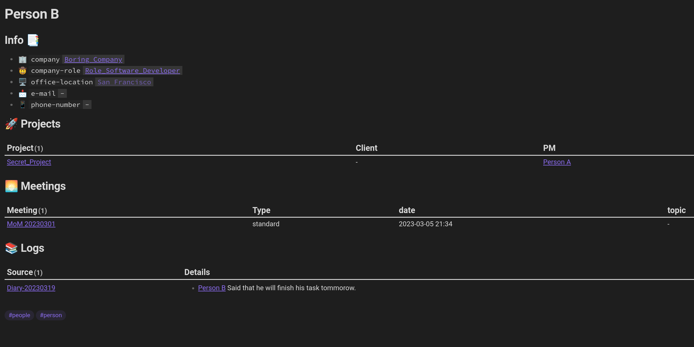
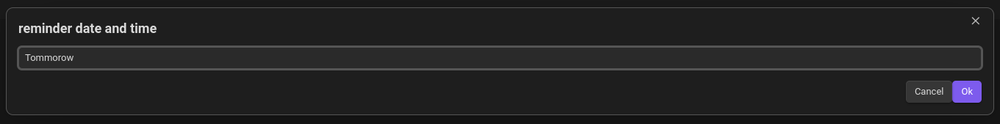
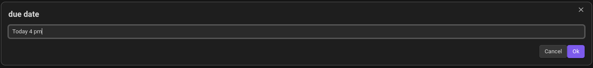
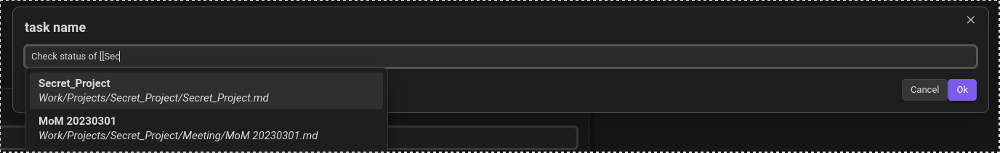
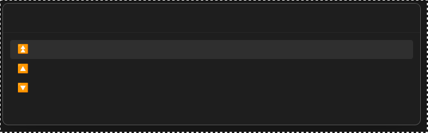

Obsidian reference vault with all needed plugins and customizations.

## Summary
Main view


### File Structure
- "__attachments__" -> Every folder has its own folder for attachments.
- "Homepage.md" -> Main page. This opens at boot.
- "__Tasks" -> All tasks goes here (try to use shortcut Alt + T).
- "__Templates" -> All templates are here.
- "__Unsorted" -> If you create new file and it is not set in the folder, it will be here.
- "Private" -> Private files
- "Private" -> Work related files (projects, people, meetings,...)
- "Learning" -> Learning materials and goals

```tree.txt
├── Homepage.md
├── .obsidian
├── __attachments__
├── __Tasks
│   ├── Ideas.md
│   └── Tasks.md
├── __Templates
│   ├── Company Role Template.md
│   ├── Company Template.md
│   ├── Diary Template.md
│   ├── Location Template.md
│   ├── Meetings
│   │   ├── 1on1 Meeting Template.md
│   │   ├── Problem Solving Meeting Template.md
│   │   └── Standard Meeting Template.md
│   ├── Person Template.md
│   └── Project Template.md
├── __Unsorted
│   └── __attachments__
├── Learning
├── Private
└── Work
    ├── Companies
    │   └── Boring Company.md
    ├── Company Roles
    │   ├── Role_QA.md
    │   └── Role_Software_Developer.md
    ├── Idea Dump.md
    ├── Locations
    │   └── Work Office.md
    ├── People
    │   ├── Person A.md
    │   └── Person B.md
    └── Projects
        └── Secret_Project
            ├── Meeting
            │   └── MoM 20230301.md
            └── Secret_Project.md
```


## How to use this template vault?
1. Download the repo as zip.
2. Unzip it in wanted folder.
3. Run Obsidian and open this vault.
4. Trust author and enable plugins.
   
5. Go through folder and tasks and clean everything up. 
6. Customize [Homepage](./Homepage.md)
7. Set up `CardBoard`


## Quick Start Guide

### Generate a diary (daily note) for today.
1. `CTRL + P`
2. Type: `new day`   (QuickAdd plugin)
3. Diary note for today will be created in the folder `Diary` with name `Diary-yyyymmdd`
4. You can access specific diary by clicking on the specific date in the calendar (upper-right corne)   

### Add new log
1. `ALT + L`
2. Write the message (you should include the person)
   ![[Pasted image 20230319165420.png]]
3. This message will occur in the diary create in the first step in the log section.
4. Also, it will be placed in the log section of the mentioned person. 
   
### Add new task
1. `ATL + T` or command  `new task`
2. Set reminder.
	  
3. Set due date.
	  
4. Set the task.
	  
5. Set the task priority.
	  
6. The task is written in the `__Tasks/Tasks.md`   (NOTE: If you want create the task in the current file use command `new task here`)
	  
8. It is also visible inside the today's diary.
9. If you set up the Card Board it will be visible there. 


	
## Features

### List of plugins 
- `Advanced Tables`
- `Auto Note Mover`
- `Banners` 
- `Buttons`
- `Calendar` Upper right corner - for diaries / daily overviews
- `CardBoard` For task overview
- `Dataview` For data/file/task/other overview
- `Editor Syntax Highlight`
- `Emoji Toolbar` Emojis
- `Full Calendar` For sync with Microsoft/Google/Other calendar 
- `Hider` 
- `Homepage` - For having homepage
- `Natural Languange Dates`
- `QuickAdd` For automation (layer above templater)
- `Reminder`
- `Tasks` For tasks (task format that supports due date, start date, end date, reminders, etc)
- `Templater` For templates
- `Weather Fetcher` 


### List of templates
- `Diary Template` - daily summary (tasks, logs, notes)
- `Project Template`
- `Person Template` 
- `Location Template`
- `Company Template`
- `Company Role Template`
- `Meetings / 
	- `Standard Meeting Template`
	- `1on1 Meeting Template`
	- `Problem Solving Meeting Template` (todo)

### Automation (Quick Add plugin)
- `new task` creates task in `__Tasks/Tasks.md`
- `new task here` creates task in the current file
- `new idea` creates idea in `__Tasks/Ideas.md`
- `new person` creates task in preferred folder
- `new project` creates project in preferred folder
- `new day` creates daily diary for today
- `new mom` creates meeting template 
- `new log` creates log ([[person]] + text) in today's summary


## Shortcuts

- `ALT + L` new log
- `ALT + T` new task
- Others are typical / visible in `Settings/Hotkeys`


